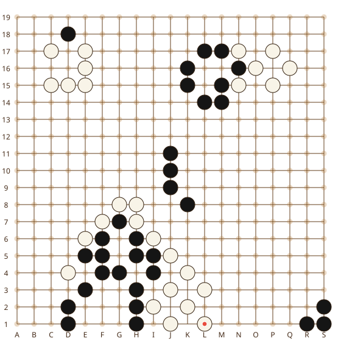

# Community Go Game

One continuous 19x19 Go game played by the GitHub community through Issues and GitHub Actions.

## Start Here

**It is Black's turn.**

1. Open **Legal Moves** below.
2. Click any blue coordinate.
3. Click **Submit new issue** without changing the move.
4. Wait for the bot, then refresh this page.

The bot validates the move and updates the board, move history, leaderboard, and statistics. GitHub Actions is automatic, but GitHub README pages do not support true live browser updates, so refresh after the workflow finishes.

## Current Turn

**Black (B)**

## Current Board



No stones have been played yet. The first accepted move will appear in `assets/board.svg`.

## How To Read The Board

Letters are columns from left to right. Numbers are rows from bottom to top. **D4** means column D and row 4.

```text
      A   B   C   D
4     .   .   .   X  <- D4
3     .   .   .   .
2     .   .   .   .
1     .   .   .   .
```

## Legal Moves

The next generated README lists every legal move, grouped by board row. The initial position has 361 legal moves. Click a coordinate to open its pre-filled move issue.

## Last 20 Moves

No moves yet.

## Player Leaderboard

No contributors yet.

## Game Statistics

- Board: **19x19**
- Move count: **0**
- Captures: **Black 0 / White 0**
- Passes: **0**
- Legal moves available: **361**
- Players: **0**
- Last move: **None yet**
- Status: **In progress**

_Game state is stored in [data/game.json](data/game.json). Rules and automation live in [src](src)._ 

See [docs/INSTALLATION.md](docs/INSTALLATION.md) for GitHub setup.
