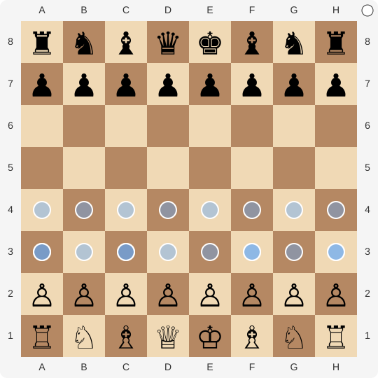

<!-- CHESS_START -->
# Shashank's Community Chess Tournament

It's your turn! Move a **white (hollow)** piece. 👋

### WHITE (hollow)
It's your move... to choose where to move...

[**Ask a friend to take the next move: share link**](https://github.com/Shashank-Karan/Shashank-Karan/stargazers)

### How this works

When you click a link (the small dots on the board), it opens a GitHub Issue with the required pre-populated text. Just push **"Submit new issue"**. That will trigger a GitHub Actions workflow that'll update my GitHub Profile README.md with the new state of the board.

### Notice a problem?

[**Raise an issue**](https://github.com/Shashank-Karan/Shashank-Karan/issues/new), and include the text. (Admin: @Shashank-Karan)

### Last few moves, this game
| Player | Move | Time |
| :--- | :--- | :--- |
| None | - | - |

### Top 20 Leaderboard: Most moves across all games, except me.
| Rank | Player | Moves |
| :--- | :--- | :--- |
| - | No moves yet | 0 |

<!-- CHESS_END -->